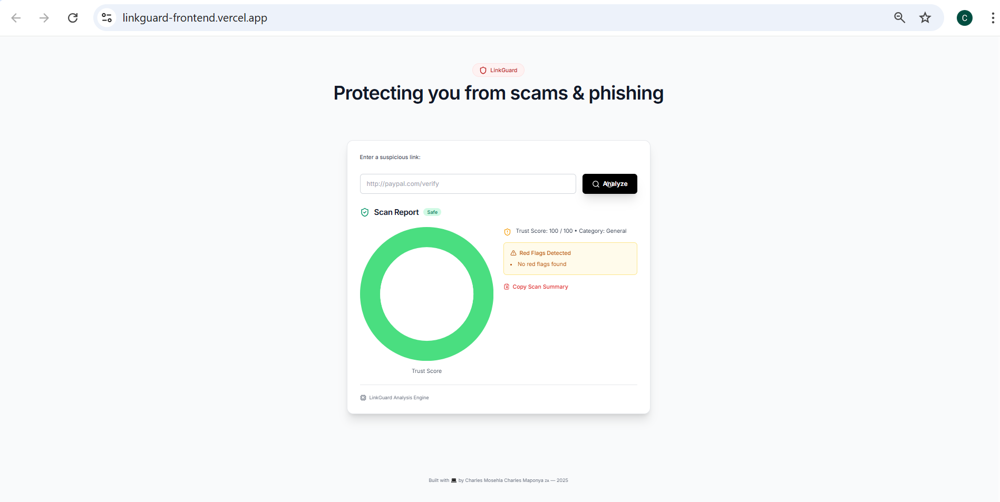
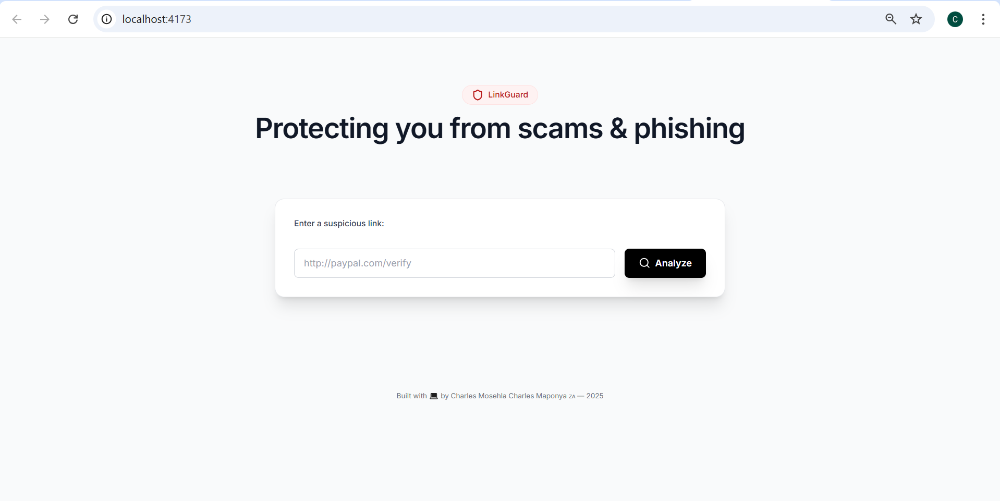

# LinkGuard Frontend

A modern React-based URL scanner interface that detects phishing and malicious links in real-time.

**Live Demo:** [Deployed on Vercel](your-vercel-url-here)

## 🚀 Run Locally

### 1. 📦 Install Vite
If not installed globally:
```bash
npm create vite@latest
```

### 2. 🛠️ Build and Preview
```bash
npm install
npm run build
npm run preview
```
Open browser at: http://localhost:4173

##  Backend API
Make sure the backend is running or deployed (e.g., Render):
```
https://linkguard-backend.onrender.com/analyze
```

### Example Scan:
**URL:** `http://free-paypaI-login.com`

**Returns:**
```json
{
  "score": 22,
  "category": "Phishing",
  "redFlags": ["Typo in domain", "Unusual structure"],
  "status": "suspicious"
}
```

## Screenshots

### Main Interface


### Secondary View  


##  Features

-  Real-time URL scanning
-  Phishing detection
-  Risk scoring system
-  Modern, responsive UI
-  Fast Vite-powered build
-  RESTful API integration

##  Technologies Used

- React + Vite
- Modern CSS/Tailwind
- RESTful API integration
- Vercel deployment

##  Deployment

This frontend is deployed on **Vercel** for fast, reliable hosting.

##  Author

**Made by Charles Mosehla Charles Maponya** 🇿🇦  
For education, portfolio building, and cybersecurity learning.

---

*LinkGuard helps protect users from malicious websites and phishing attempts.*
